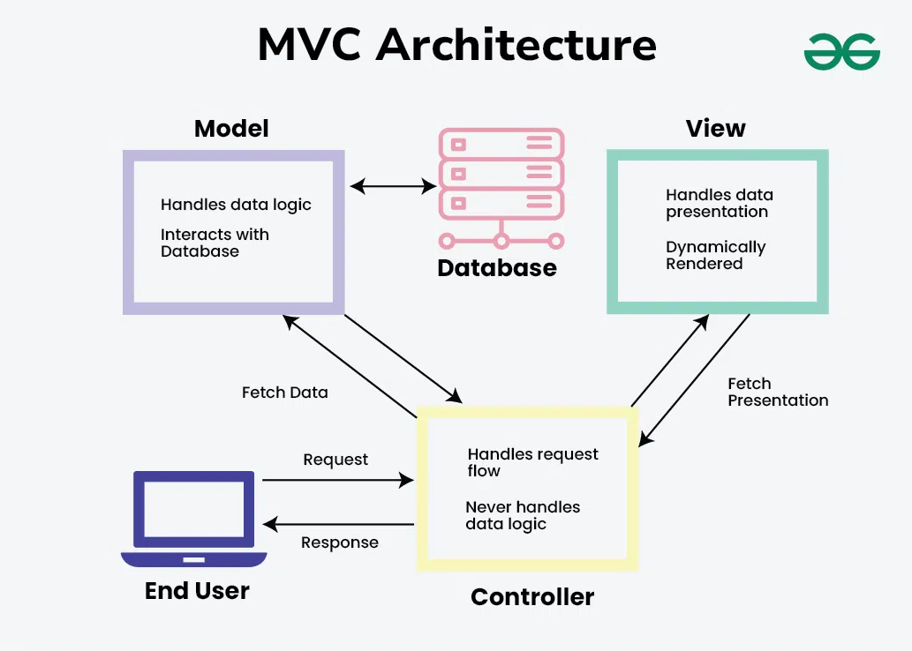
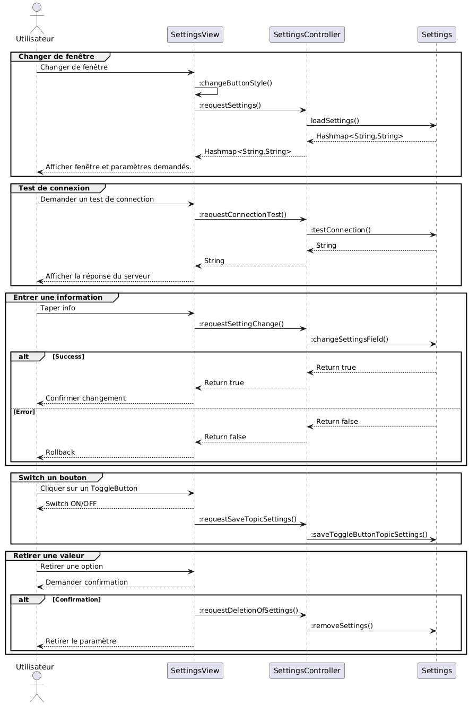
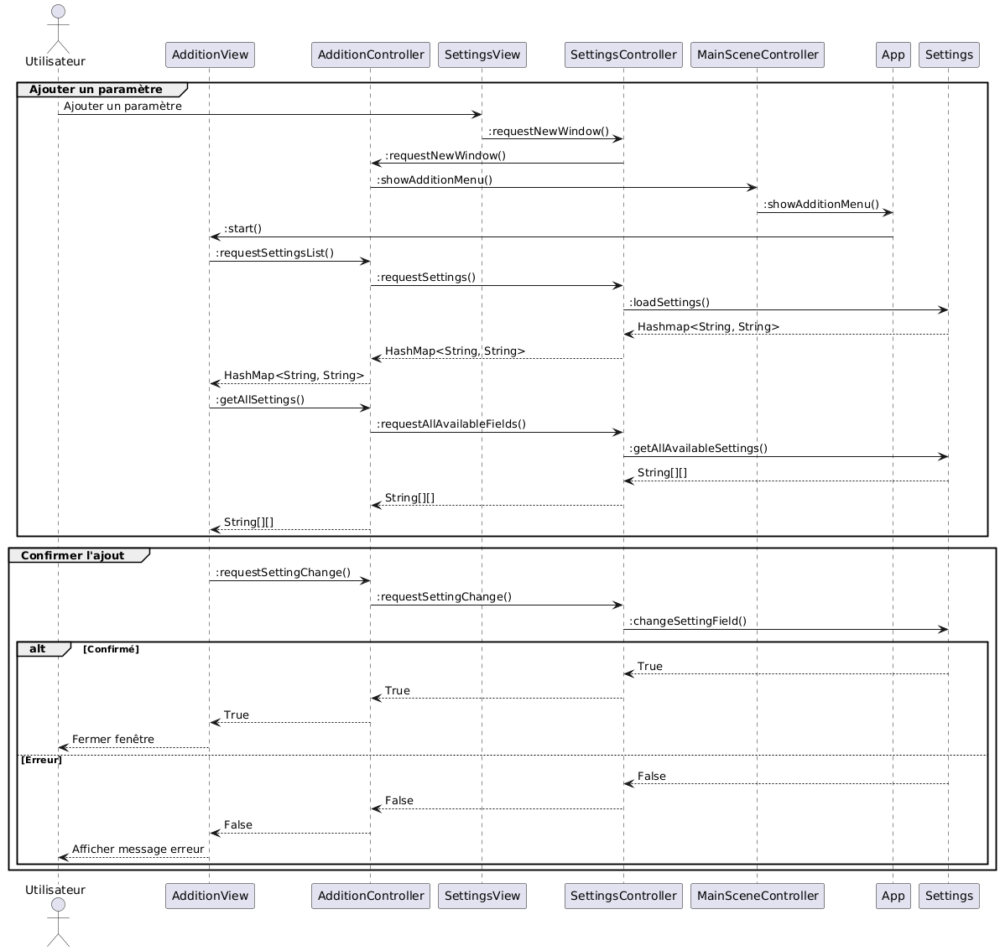
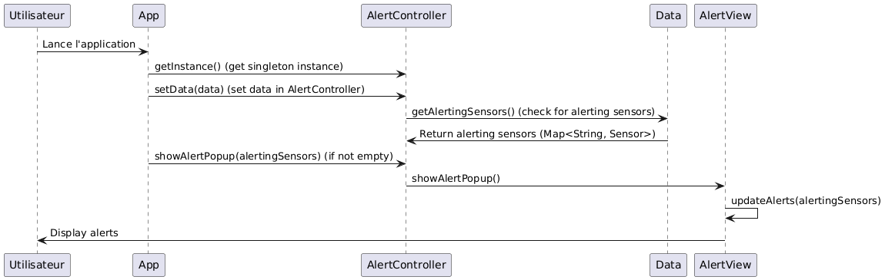

= Documentation Technique - Abraca-dabra-cadabra
:toc:
:toc-title: Sommaire

:Entreprise: Abraca-dabra-cadabra
:Equipe:  

Date: 20/11/2024

Créé par : _MARTINEZ Quentin_ | _CHAUVIERE Romy_ | _ESTIENNE Alban-Moussa_ | _PAPA-PATSOUMOUDOU Matthias_ | _GIARD--PELLAT Jules_ 

Créé pour : _Esther Pendaries_

image::../../images/IUT.png[IUT Blagnac]

---

== I. Introduction
[.text-justify]
Ce document présente la structure de l'architecture de l'application utilisant les données de capteurs atmosphériques et solaires afin de les afficher sous forme de diagrammes et graphiques, tout en permettant un paramétrage rapide et facile des différentes données à récolter.

== II. Présentation de l'application
[.text-justify]
Développement de l'existant, ainsi que des fonctionnalités de chaque membre du groupe.

== III. Architecture
[.text-justify]
.L'application se divise en plusieurs section :
 * Le _src_ qui contiendra toutes les classes en java +
 * Le _resources_ qui contiendra toutes les ressources nécessaires au _src_ pour son bon fonctionncement, cela inclut : +
  ** Le ressources/data_collecting qui inclut tout ce qu'utilise la collecte de données en python. Donc : +
    *** Le config.ini qui définit ce que le fichier python doit récolter (La liste des topics, les types de données, les salles...) +
    *** Le data.json qui contient les données récoltés.+
  ** Les images, CSS, autres éléments de style mais également les .fxml pour les views. 
--
.L'architecture de l'application est de types MVC (Model-View-Controller). Cela consiste en : 
 * Les modèles fournissent les données, et accèdent à toutes les structures contenant des données.
 * Les controllers assurent le lien entre view et model, en fournissant des services de requêtes et de notifications lorsque des données changent. 
 * Les views ne font que recevoir les données et les afficher. Elles ne communiquent qu'avec leur controller et ne gèrent aucun traitement de données.
--
Cette architecture permet notemment une organisation claire des structures de données et une maintenance plus aisées du code, en raison de leur séparation claire des fonctionnements.

== IV. Présentation des fonctionnalités
[.text-justify]
Effectuer les Use Case et les Diagrammes de classes pour chaque fonctionnalité développée.

=== 1. Package : Model 
==== Settings architecture
[.text-justify]
===== A. La classe Settings
La classe `Settings` est un modèle qui permet un accès en lecture/écriture au fichier `config.ini`.  
Elle permet généralement de lire un ou plusieurs paramètres spécifiques, ainsi que de mettre à jour, supprimer ou créer des paramètres demandés.

Cette classe gère toutes les vérifications nécessaires pour garantir un fichier de configuration valide  
et fournit une réponse appropriée que le contrôleur peut transmettre.

Cette classe ne fait appel à aucune classe écrite sur mesure, seulement les classes de bases fournies par Java tel que les Observables afin de permettre au Controller d'être notifié des changements dans les settings.

===== B. La classe SettingsController

La classe `SettingsController` est une *classe Singleton* qui fait le lien entre  
`java_iot.view.SettingsView` et `java_iot.model.Settings`.

Cette classe est uniquement responsable de la transmission des requêtes depuis la vue et de la transmission des mises à jour vers la vue.

Cette classe ne contient que des références au Model et au View que gère ce controller, et seulement des méthodes d'appels entre le view et le model.

===== C. La classe SettingsView

La classe `SettingsView` fonctionne en collaboration avec `java_iot.model.Settings` et gère  
la partie graphique de l'interface des paramètres. Elle stocke une référence au contrôleur  
principal de la scène.  

`SettingsView` est une classe *Singleton*, car elle doit empêcher la duplication des opérations  
de lecture et d’écriture des données.  

`SettingsView` doit être utilisée UNIQUEMENT au sein du package `view`, car la barre de navigation  
(`Navbar`) doit appeler un processus de chargement des données pour obtenir les paramètres  
appropriés sans requêtes supplémentaires.

Cette classe est techniquement une extention de la `MainSceneView`, puisque `SettingsView` ne gère qu'une Pane inclut dans `MainSceneView`. C'est la raison pour laquel certaines variables sont en protected dans `MainSceneView` 

==== Architecture : Addition

Le MVC de `Addition` est un peu particulier car `Addition` utilise les données de `Settings` en passant par `SettingsController` afin d'écrire les modifications. Cela est justifié par le fait que `Addition` est techniquement une extention de `Settings`, car cette classe est appellée lorsque le bouton "Plus" dans `SettingsView` est cliqué.

===== A. AdditionController

La classe `AdditionController` fait le lien entre `java_iot.view.AdditionView`  
et tous les différents contrôleurs qu'elle utilise pour fonctionner (principalement `java_iot.controller.SettingsController`). 

Contrairement aux autres Controller, ce controller est techniquement une autre extention de `MainSceneController`, ce qui fait qu'elle va essentiellement passer par `SettingsController` (elle même une extention de `MainSceneController`) afin d'accéder à la classe `Settings` lui permettant d'avoir la liste des paramètres disponibles et ceux déjà paramétrés. Mais également afin de pouvoir soumettre les modifications de l'utilisateur au modèle.

===== B. AdditionView

La classe `AdditionView` est appelée lorsque l'utilisateur tente de créer un nouveau paramètre dans l'onglet de traitement des données de l'application.

Cette classe gère uniquement la lecture et la transmission des entrées de l'utilisateur à son contrôleur dédié.

Cette classe *NE RÉFÉRENCE QUE* `java_iot.controller.AdditionController` et `java_iot.App`, car ces références sont nécessaires pour assurer son bon fonctionnement.

==== Alertes architecture

===== A. AlertController

La classe 'AlertController' fait le lien entre la classe 'Data' et la classe 'AlertView', permettrant d'afficher les données récupérées sur le topic MQTT par la classe 'Data'.

Cette classe a pour seul et unique but de récupérer les salles/les capteurs et la valeur concernée afin de pouvoir le donner au view qui l'affichera dans une fenêtre à part.

'AlertController' est un singleton afin de s'assurer que le signal d'alerte envoyé à AlertView ne peut pas venir de plusieurs instances, faussant potentiellement l'affichage.

===== A. AlertView

La classe 'AlertView' est appelée dans l'application lorsqu'une alerte est détectée dans les données chargées par le programme.

Elle a pour but de récupérer les données et les afficher dans une liste d'alertes.

===== C. Diagramme de séquence

=== 2. Diagramme de classes :
[.text-justify]

== V. Comment installer
[.text-justify]
.Pour le python : 
- Lancer une console CMD sur Windows ou un terminal bash sur Linux
- Taper : `python -m ensurepip --upgrade`. Si cela ne marche pas, remplassez `python` par le chemin du .exe de python. 
- Taper : `pip install paho-mqtt`. Cela télécharge la librairie de connexion au Broker.
- Lancer le script Python situé dans `src/main/resources/java_iot/ressources/data_collecting/main.py` au moyen de l'application ou directement avec un éxécutable Python.
- Les données récupérées du Broker s'affichent en temps réelle dans la console si le mode débug est activé. Le script ne se connecte qu'aux topics demandés et ne conserve que les données demandées.

=== 1. Installer Maven

==== Étape 1 : Télécharger Maven
1. Rendez-vous sur le site officiel de Maven : https://maven.apache.org/download.cgi[].
2. Téléchargez la dernière version binaire.
3. Extrayez le fichier compressé dans un répertoire de votre choix, par exemple `C:\Program Files\Apache\Maven`.

==== Étape 2 : Configurer les variables d'environnement
1. Ajoutez `MAVEN_HOME` dans vos variables d'environnement système :
   * Chemin : Répertoire où Maven est installé (ex. : `C:\Program Files\Apache\Maven`).
2. Ajoutez `MAVEN_HOME\bin` au `PATH` pour rendre Maven accessible depuis la ligne de commande.
3. Vérifiez l'installation en ouvrant un terminal et en tapant :
----
mvn -v
----
   Cela doit afficher la version de Maven ainsi que la configuration Java.

=== 2. Installer Visual Studio Code et extensions

==== Étape 1 : Installer VS Code
1. Téléchargez Visual Studio Code depuis https://code.visualstudio.com/[].
2. Installez-le sur votre machine.

==== Étape 2 : Installer les extensions nécessaires
1. Ouvrez Visual Studio Code.
2. Accédez à l'onglet Extensions (icône de carrés empilés ou raccourci `Ctrl+Shift+X`).
3. Recherchez et installez les extensions suivantes :
   * *Extension Pack for Java* (inclut des outils comme Language Support for Java et Debugger for Java).
   * *Maven for Java* (pour gérer des projets Maven dans VS Code).
