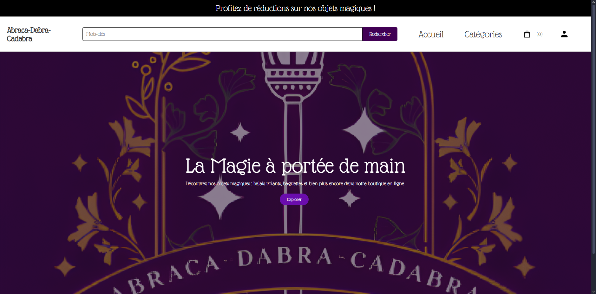
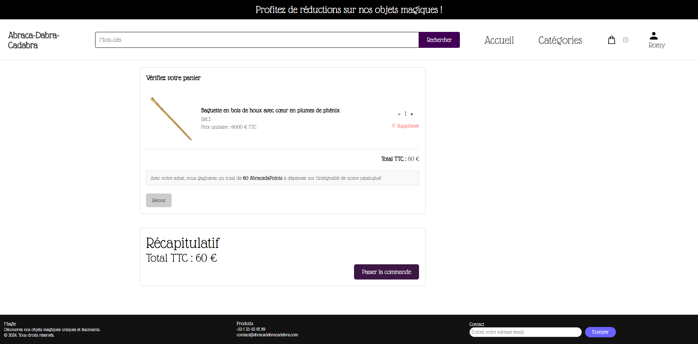
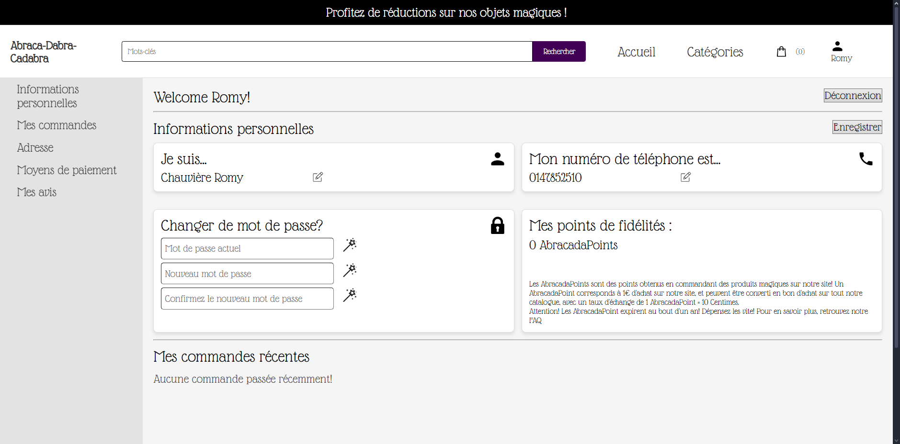
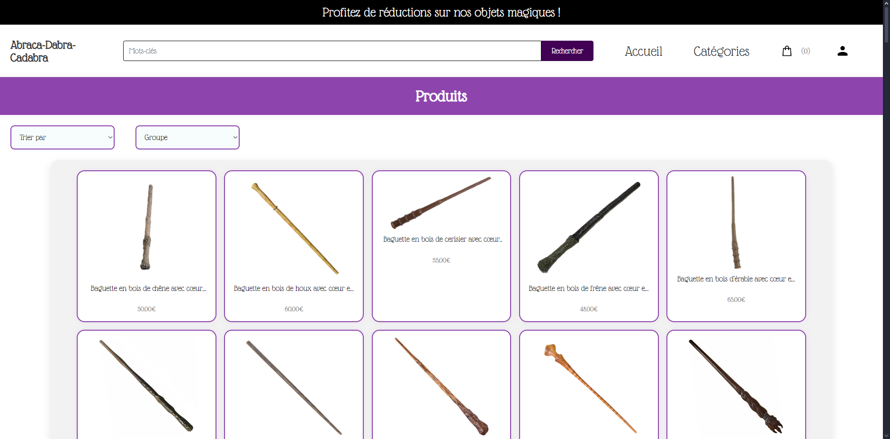

= Documentation Utilisateur - Abraca-dabra-cadabra
:toc:
:toc-title: Sommaire

:Entreprise: Abraca-dabra-cadabra
:Equipe:  

Date: 20/11/2024

Créé par : _MARTINEZ Quentin_ | _CHAUVIERE Romy_ | _ESTIENNE Alban-Moussa_ | _PAPA-PATSOUMOUDOU Matthias_ | _GIARD--PELLAT Jules_ 

Créé pour : _Esther Pendaries_

image::../../images/IUT.png[IUT Blagnac]
image::../../images/LOGO IUT.png[IUT Blagnac, width=150, height=150]

---

== I. Introduction
[.text-justify]
Ce document a été élaboré dans le cadre de la conception du site web e-commerce de l’entreprise "Abraca-dabra-cadabra". Il a pour objectif de fournir une perspective utilisateur en identifiant les besoins, attentes et fonctionnalités essentielles pour garantir une expérience la plus fluide et intuitive possible.

== II. Présentation générale
[.text-justify]

Le site e-commerce "Abraca-dabra-cadabra" est une plateforme dédiée à l’univers de la magie. Il permet aux utilisateurs de découvrir, sélectionner et acheter facilement une grande variété de produits magiques, des accessoires simples aux équipements professionnels, adaptés aux amateurs comme aux experts de la magie.

L’objectif principal de l’application est d’offrir une expérience utilisateur optimale grâce à :

* Une navigation intuitive et accessible : Permettre aux utilisateurs de trouver rapidement les produits et services depuis n’importe quel appareil, qu’il s’agisse d’un ordinateur ou d’un smartphone.

* Une immersion totale dans l’univers magique : Captiver l’utilisateur avec des contenus interactifs, des descriptions riches, et des conseils personnalisés adaptés à ses besoins.

* Un parcours d’achat simplifié et sécurisé : Assurer une recherche fluide, un processus de commande rapide, et des options de paiement fiables et personnalisées pour maximiser la satisfaction utilisateur.

== III. Installation utilisation
[.text-justify]

Requis : Un appareil connecté à Internet (ordinateur, tablette, smartphone).

Navigateur recommandé : Google Chrome, Mozilla Firefox, Microsoft Edge ou Safari.

Adresse du site : http://193.54.227.208/~R2024SAE3004/SAE/[abraca-dabra-cadabra.fr]

Étapes pour accéder au site :

1. Lancez votre navigateur.

2. Saisissez l’adresse suivante dans la barre de recherche (ou cliquez sur le lien) : http://193.54.227.208/~R2024SAE3004/SAE/[abraca-dabra-cadabra.fr]

3. Appuyez sur Entrée pour accéder à la page d’accueil.

= Fonctionnement du site web

== IV.1. Page d'accueil
La page d'accueil centralise toutes les fonctionnalités du site web et sert de point de départ pour la navigation. Elle est accessible à tout moment en cliquant sur le logo ou sur l'option "Accueil" dans le menu principal.

== IV.2. Barre de recherche
Une barre de recherche est disponible dans le menu principal sur la page d'accueil. Elle permet aux utilisateurs de trouver facilement des produits en saisissant un mot-clé. Après avoir entré un mot-clé et cliqué sur le bouton "Rechercher", une liste de produits correspondants s'affichera.

== IV.3. Catégories
L'option "Catégorie", située dans le menu principal, redirige vers une page listant toutes les catégories de produits disponibles. Chaque catégorie est cliquable et mène à une page affichant les produits associés. Ces produits peuvent ensuite être triés selon différents critères (par exemple, par prix ou popularité). L'utilisateur peut consulter une fiche produit détaillée en cliquant sur un produit spécifique.

== IV.4. Panier

* Sur la page détaillée d'un produit, un bouton "Ajouter au panier" permet d'ajouter l'article au panier.

* Les articles ajoutés peuvent être consultés via la page "Panier", représentée par une icône de sac de shopping dans le menu principal.

* La page panier permet de gérer les articles avant de finaliser la commande.

== IV.5. Comptes

* Navigation sans compte : La navigation sur le site est possible sans créer de compte.

* Connexion obligatoire pour passer commande : Lors du processus de commande ou lors de l'accès à la section "Compte", il est nécessaire de se connecter.

** Options de connexion : Vous pouvez vous connecter avec un compte existant ou créer un nouveau compte qui sera utilisable immédiatement.

* Espace client : Une fois connecté, vous aurez accès à :

** Vos commandes passées.

** Vos informations personnelles (e-mail, numéro de téléphone, adresse).

** Vos points de fidélité.

== IV.6. Explorer
Accessible depuis la page d'accueil via le bouton "Explorer", cette fonctionnalité permet de parcourir l'ensemble du catalogue de produits sans restrictions. Cependant, des options de tri (par prix, avis, catégorie, etc.) sont disponibles pour affiner votre recherche.

== IV.7. Fiche produit détaillée
En cliquant sur un produit, vous serez redirigé vers une page dédiée présentant les informations suivantes :

* Une photo du produit.

* Le nom du produit.

* Les détails et caractéristiques du produit.

* La possibilité de laisser un avis (si vous avez acheté le produit).

* Un champ pour indiquer la quantité souhaitée.

* Un bouton "Ajouter au panier" pour inclure le produit à votre commande.

== V. Résultats produits
[.text-justify]

=== V.1. Page d'accueil

=== V.3. Catégories

=== V.4. Panier

=== V.5. Compte

=== V.3. Explorer

