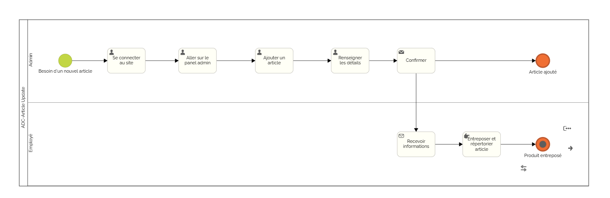
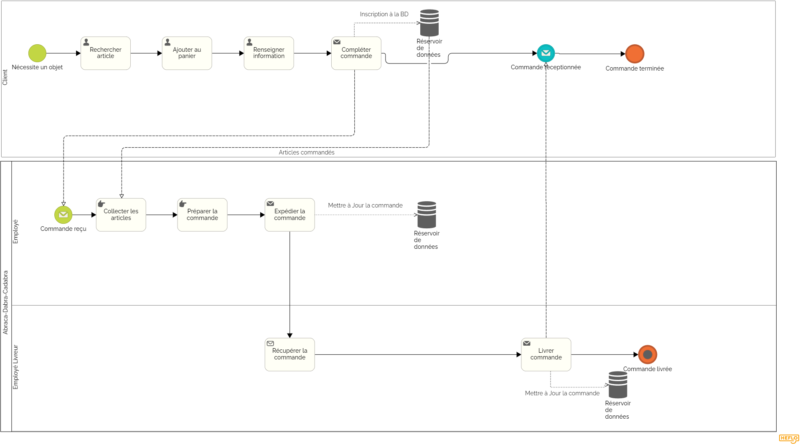

= Documentation Utilisateur - Abraca-dabra-cadabra  
:toc: macro
:toc-title: Sommaire  

*Entreprise* : Abraca-dabra-cadabra  

*Equipe* :  2B10

*Membres* :

** MARTINEZ Quentin
** CHAUVIERE Romy
** ESTIENNE Alban-Moussa
** PAPA-PATSOUMOUDOU Matthias
** GIARD--PELLAT Jules

*Date* : 11/12/2024  

*Créé pour* : _Esther Pendaries_  

image::../../images/IUT.png[IUT Blagnac]  
image::../../images/LOGO IUT.png[IUT Blagnac, width=150, height=150]  

'''

toc::[]

== I. Introduction  
[.text-justify]  
Ce document a été conçu pour fournir aux administrateurs une vue détaillée des fonctionnalités et outils nécessaires à la gestion et à la maintenance du site e-commerce *"Abraca-dabra-cadabra"*. Il explique les étapes clés de l'administration du site, les fonctionnalités principales et les meilleures pratiques pour assurer une expérience utilisateur fluide.  

== II. Rôles et responsabilités de l’administrateur  
[.text-justify]  

Les administrateurs jouent un rôle central dans le bon fonctionnement du site e-commerce. Voici leurs principales responsabilités :  

* **Gestion des utilisateurs** : Surveiller les activités des utilisateurs, gérer les comptes clients, et traiter les demandes de support.  
* **Gestion du catalogue produit** : Ajouter, modifier ou supprimer des produits, catégories et descriptions.  
* **Surveillance des commandes** : Valider, expédier et suivre les commandes passées par les clients.  
* **Sécurité et mises à jour** : Garantir la sécurité des données, surveiller les paiements, et effectuer des mises à jour régulières du site.  
* **Statistiques et rapports** : Analyser les données de performance et générer des rapports pour optimiser les ventes.  

== III. Accès au panneau d'administration  

=== 1. Requis techniques  
* Un appareil connecté à Internet (ordinateur de préférence).  
* Un navigateur à jour (Google Chrome, Mozilla Firefox, Microsoft Edge ou Safari).  
* Identifiants administrateur (nom d’utilisateur et mot de passe).  

=== 2. Connexion  
. Ouvrez votre navigateur.  
. Accédez à l’URL dédiée au panneau d’administration
. Entrez vos identifiants administrateur et cliquez sur "Se connecter".  
. Vous serez redirigé vers le tableau de bord principal.  

== IV. Fonctionnalités administratives  

=== IV.1. Tableau de bord  
Le tableau de bord fournit une vue d’ensemble des statistiques clés : commandes en cours, nombre d’utilisateurs actifs, nouveaux produits ajoutés, etc.  

=== IV.2. Gestion des produits  
*Ajouter un produit* :  
. Naviguez vers l’onglet *"Catalogue"*.  
. Cliquez sur *"Ajouter un produit"*.  
. Remplissez les champs nécessaires : nom, description, prix, stock, catégorie, et image.  
. Cliquez sur *"Enregistrer"*.  

*Modifier ou supprimer un produit* :  
. Sélectionnez le produit dans la liste du catalogue.  
. Cliquez sur *"Modifier"* pour ajuster les détails ou sur *"Supprimer"* pour le retirer du catalogue.  

=== IV.3. Gestion des commandes  
. Accédez à l’onglet *"Commandes"*.  
. Consultez la liste des commandes :  
**En attente** : Commandes à valider.  
**En cours** : Commandes en traitement.  
**Finalisées** : Commandes expédiées.  
. Pour chaque commande, vous pouvez :  
** Valider la commande.  
** Mettre à jour le statut d’expédition.  
** Télécharger la facture associée.  

=== IV.4. Gestion des utilisateurs  
. Rendez-vous dans l’onglet *"Utilisateurs"*.  
. Consultez ou recherchez un utilisateur spécifique.  
. Options disponibles :  
** Modifier les informations personnelles.  
** Réinitialiser un mot de passe.  
** Désactiver ou supprimer un compte.  

=== IV.5. Suivi des paiements  
. Accédez à l’onglet *"Paiements"*.  
. Vérifiez l’historique des transactions : montant, statut (réussi ou échoué), mode de paiement.  
. Signalez les anomalies en contactant le support technique.  

=== IV.6. Paramètres du site  
. Modifiez les options globales via l’onglet *"Paramètres"* :  
** Langue et devises.  
** Méthodes de livraison.  
** Configuration des e-mails automatiques.  
. Sauvegardez vos modifications pour qu’elles soient prises en compte immédiatement.  

=== IV.7. Diagrammes de collaboration

==== IV.7.1. Diagramme de collaboration : Création d'un produit

Ce diagramme illustre les interactions entre les différents acteurs et composants du système lors de la création d'un produit. Il facilite la compréhension du processus en montrant le flux de communication et les étapes nécessaires.

==== IV.7.2. Diagramme de collaboration : Suivi d'une commande complète

Le diagramme de suivi de commande complète décrit les échanges entre les administrateurs, les clients, et les systèmes internes du site e-commerce, du moment où une commande est passée jusqu'à sa livraison. Il aide à visualiser les responsabilités et les actions à chaque étape.

== V. Maintenance et bonnes pratiques  

=== 1. Sauvegardes régulières  
Planifiez des sauvegardes hebdomadaires des données du site via l’onglet *"Sauvegardes"*.  

=== 2. Surveillance de la sécurité  
* Mettez à jour les modules et extensions régulièrement.  
* Activez l’authentification à deux facteurs pour les administrateurs.  
* Supprimez les comptes inutilisés.  

=== 3. Communication avec les clients  
Utilisez l’onglet *"Messages"* pour répondre aux requêtes clients et signalements.  

=== 4. Formation continue  
Organisez des sessions régulières pour maintenir les administrateurs à jour sur les nouvelles fonctionnalités et bonnes pratiques.  

== VI. Annexes  

=== VI.1. Ressources utiles  
* **Support technique** : `support@abraca-dabra-cadabra.fr`  
* **Documentation technique** : Disponible dans l’onglet *"Aide"* du panneau d’administration.  
