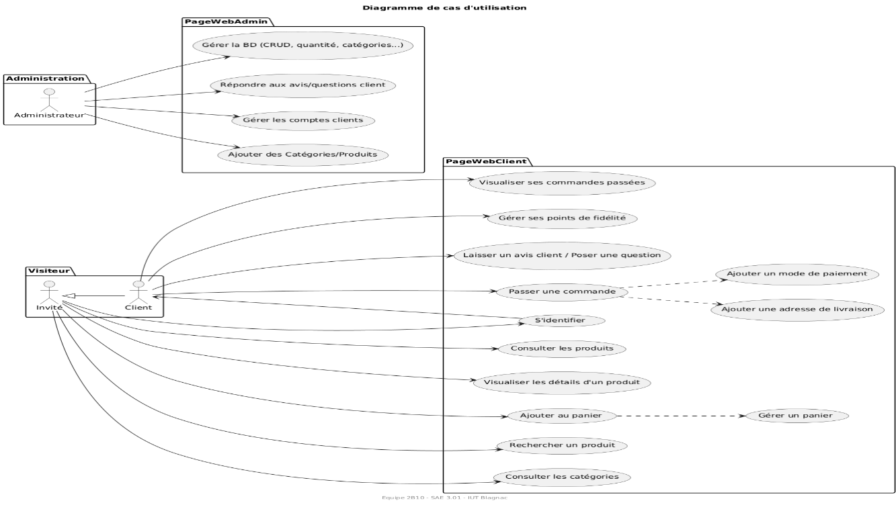
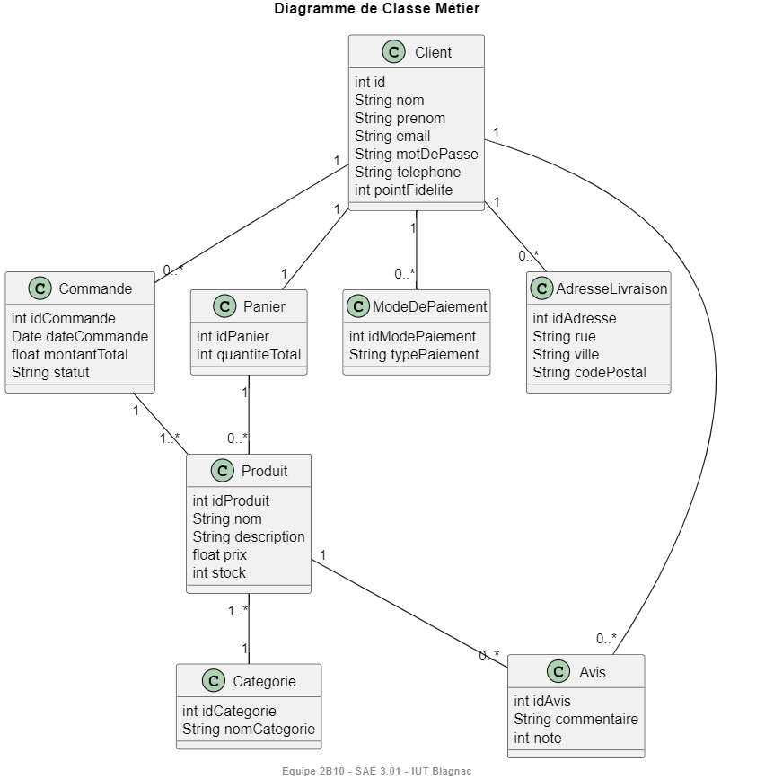
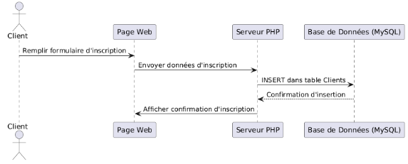
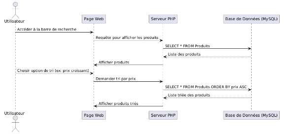
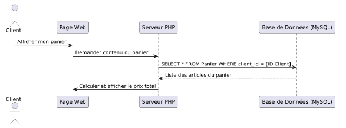
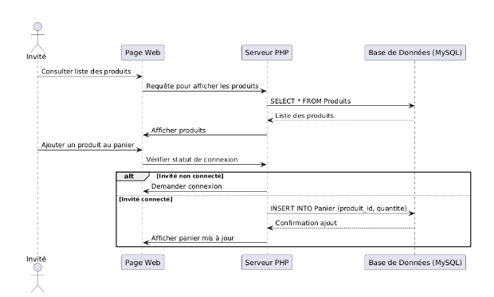
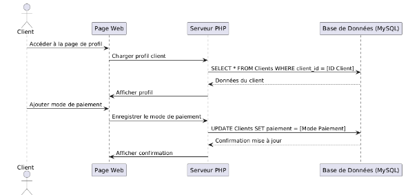
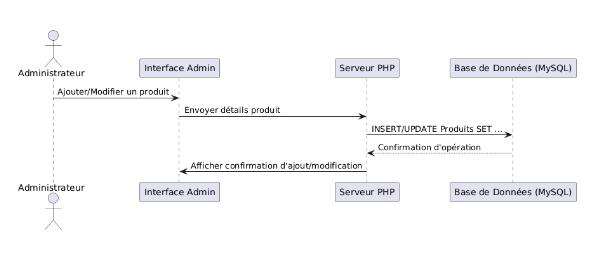

= Documentation Conception - Abraca-dabra-cadabra
:toc:
:toc-title: Sommaire

:Entreprise: Abraca-dabra-cadabra
:Equipe:  2B10

Date: 08/11/2024

Créé par : _Quentin Martinez_ | _Jules Giard--Pellat_ | _Romy Chauviere_ | _Alban-Moussa Estienne_ | _Matthias Papa-Patsoumoudou_

Créé pour : _Jean-Michel Bruel_ | _Esther Pendaries_

image::../../images/IUT.png[IUT Blagnac]

---

== I. Introduction
[.text-justify]
Ce document a été produit pour rassembler l'ensemble des diagrammes demandés (US, DC, DSS) dans le cadre d'un projet de développement de site web d'e-commerce pour l'entreprise Abraca-dabra-cadabra.
Abraca-dabra-cadabra opère dans le secteur de la vente et des services, plus spécifiquement dans le domaine d'activité de la magie depuis des siècles. L'entreprise est une référence dans la matière, cependant elle a noté un déclin dans les ventes ces dernières années.

L'objectif du projet est de concevoir un site sur lequel Abraca-dabra-cadabra pourra vendre ses produits et services comme en boutique, tout en attirant une nouvelle clientèle, redynamisant ainsi l'activité de l'entreprise. 

Le projet est actuellement à échelle nationale mais pourrait à l'avenir évoluer vers une portée plus internationale. La clientèle visée est constituée majoritairement de passionnés de magie et d'alchimie qui savent généralement ce qu'ils cherchent. Le site devra donc répondre à cette attente en proposant un système de recherche et de catégories abouti et facile d'utilisation. 

== II. Diagramme des Cas d'Utilisation
[.text-justify]

_Figure 1. Diagramme des Cas d'Utilisation_

== III. Diagramme de classes métiers
[.text-justify]

_Figure 2. Diagramme de classes métiers_

== IV. Diagramme de séquence système
[.text-justify]

=== 1. Cas d'utilisation : Inscription (Client)
[.text-justify]

_Figure 3. Diagramme de séquence système_

=== 2. Cas d'utilisation : Comparaison des produits (Invité)
[.text-justify]

_Figure 4. Diagramme de séquence système_

=== 3. Cas d'utilisation : Consultation du panier (Client)
[.text-justify]

_Figure 5. Diagramme de séquence système_

=== 4. Cas d'utilisation : Consultation et ajout au panier (Invité)
[.text-justify]

_Figure 6. Diagramme de séquence système_

=== 5. Cas d'utilisation : Ajout d'un mode de paiement (Client)
[.text-justify]

_Figure 7. Diagramme de séquence système_

=== 6. Cas d'utilisation : Gestion BD (Admin) 
[.text-justify]

_Figure 8. Diagramme de séquence système_
