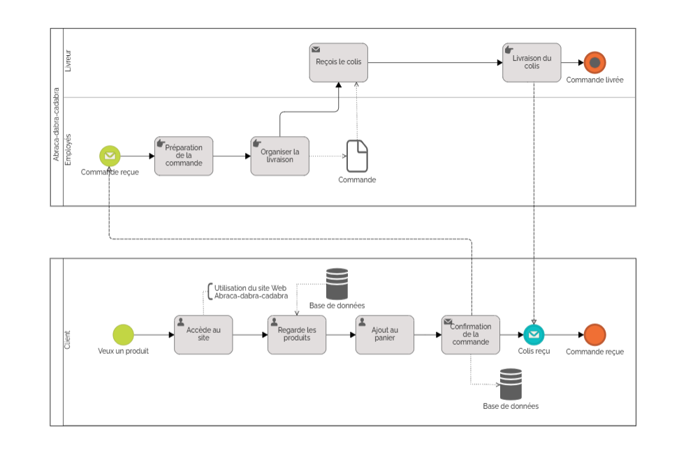

=  Fiche de conseils juridiques et de sécurité - Abraca-dabra-cadabra
:toc:
:toc-title: Sommaire

:Entreprise: Abraca-dabra-cadabra
:Equipe:  

Date: 20/12/2024

Créé par : _MARTINEZ Quentin_ | _CHAUVIERE Romy_ | _ESTIENNE Alban-Moussa_ | _PAPA-PATSOUMOUDOU Matthias_ | _GIARD--PELLAT Jules_ 

Créé pour : _Esther Pendaries_

image::../../images/IUT.png[IUT Blagnac]
image::../../images/LOGO IUT.png[IUT Blagnac, width=150, height=150]

---

=== I. La liste des mentions légales que doit comporter le site WEB et préciser les mentiobs actuellement manquantes sur le site de votre client.
==== Mentions légales obligatoires :

- **Identité de l'entreprise :**  
  Nom, prénom et adresse.  

- Si vous êtes entrepreneur individuel (y compris micro-entrepreneur), vos nom et prénom sont accompagnés de la mention *entrepreneur individuel* ou des initiales correspondantes.  
- **Numéro d'immatriculation au RCS :**  
  RCS (Registre du commerce et des sociétés).  

- **Mail et numéro de téléphone :**  
  Informations nécessaires pour contacter l'entreprise.  

- **Identité de l'hébergeur :**  
  Nom et coordonnées de l’hébergeur du site web.  

- **Conditions Générales de Vente (CGV) :**  
  Les CGV encadrent les relations commerciales. 

- **Données personnelles :**  
  Informer l'internaute sur la gestion et la protection de ses données personnelles.  

- **Résiliation du contrat :**  
  Fournir des informations claires sur les modalités de résiliation.  

- **Cookies :**  
  Informations sur leur usage et modalités d’acceptation ou de rejet.  

- **Propriété intellectuelle :**  
  Indication sur la protection des contenus (textes, images, logos).  

==== Mentions manquantes :

- **Conditions générales de vente**

- **Cookies**

Source : https://entreprendre.service-public.fr/vosdroits/F31228[Mentions légales]

=== II. Une description détaillée du processus de vente en ligne à l’aide d’un diagramme de collaboration BPMN. 

=== III. Une liste de mesures applicables et leurs modalités de mise en œuvre concernant la protection des données 

[cols="3,2,1", options="header"]
|===
| Mesure                              | Modalités                                                                                           | Priorité 

| Recueil du consentement des utilisateurs | Introduire une case à cocher obligatoire lors du processus d'enregistrement du compte.              | Must  
| Introduire des mentions CNIL             | Ajouter les informations légales et les droits des utilisateurs dans les formulaires.              | Must  
| Offrir un contrôle des données           | Ajouter un lien pour gérer les cookies et un formulaire pour l'accès, la rectification ou la suppression des données. | Must  
| Sécuriser les données sensibles          | Activer le protocole HTTPS, hacher avec un algorithme sécurisé les mots de passe (bcrypt).          | Must  
| Désigner un délégué à la protection des données (DPO) | Réaliser une PIA pour les traitements à risque élevé.                                               | Should 
|===

=== IV. Une liste de mesures applicables et leurs modalités de mise en œuvre concernant la sécurité des données sur le même modèle que ci-dessus. 

[cols="3,2,1", options="header"]
|===
| Mesure                              | Modalités                                                                                           | Priorité 

| Chiffrement des données sensibles    | Hachage avec un algorithme sécurisé (bcrypt).                                                       | Must  
| Activer le protocole HTTPS           | Forcer l’utilisation de HTTPS sur l’ensemble du site pour sécuriser les échanges de données.        | Must  
| Protéger contre les attaques XSS     | Mettre en place une validation des entrées utilisateur et utiliser des outils pour éviter les injections XSS. | Must  
| Utilisation de mots de passe complexe | Exiger un minimum de 8 caractères comprenant majuscules, minuscules, chiffres et caractères spéciaux. | Must  
| Ne pas conserver les coordonnées bancaires | Utiliser un prestataire tiers pour les paiements et ne jamais stocker ces données localement.       | Must  
|===

=== V. La liste des US à ajouter au dernier sprint pour tenir compte des points

[cols="1,3,1", options="header"]
|===
| US    | Description                                                                                          | Priorité

| US01  | En tant qu’utilisateur, je veux qu’une case à cocher obligatoire apparaisse lors de l’inscription pour consentir au traitement des données. | Must  
| US02  | En tant qu’utilisateur, je veux pouvoir accéder à un formulaire permettant de demander l'accès, la modification ou la suppression de mes données. | Must  
| US03  | En tant qu’utilisateur, je veux que le site utilise HTTPS pour sécuriser mes échanges de données.    | Must  
| US04  | En tant qu’administrateur, je veux que les mots de passe des utilisateurs soient stockés en utilisant un hachage sécurisé (bcrypt). | Must  
| US05  | En tant qu’utilisateur, je veux pouvoir gérer mes préférences de cookies via un lien accessible.     | Must  
| US06  | En tant qu’administrateur, je veux disposer d’un registre listant les traitements des données avec leurs finalités et durées de conservation. | Should  
| US07  | En tant qu’utilisateur, je veux qu’une page dédiée à la vie privée soit disponible pour comprendre les pratiques de traitement des données. | Should  
| US08  | En tant qu’administrateur, je veux effectuer une évaluation PIA pour les fonctionnalités à haut risque. | Could  
|===
